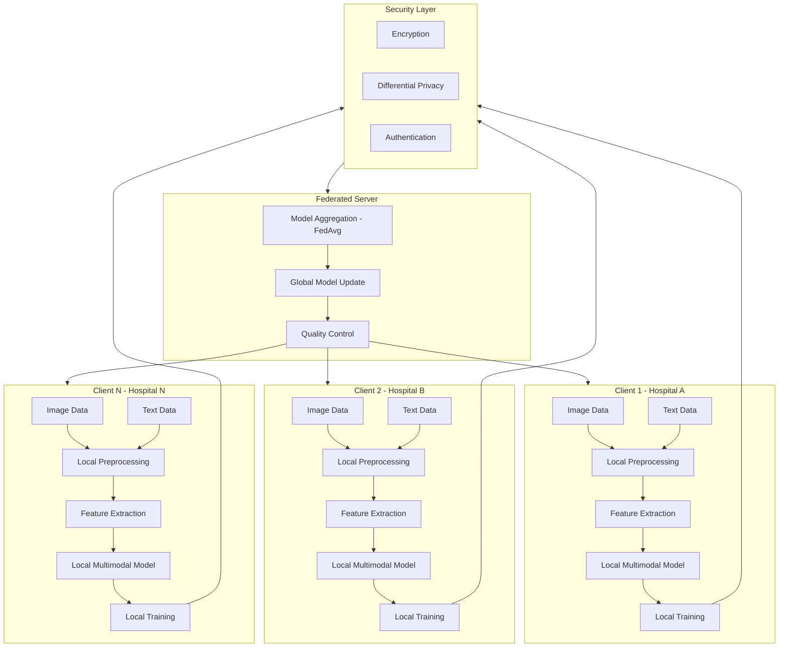

# NGHIÊN CỨU KHOA HỌC

- Tên đề tài tiếng Việt: ỨNG DỤNG PHƯƠNG PHÁP HỌC LIÊN KẾT KẾT HỢP VỚI TRÍ TUỆ NHÂN TẠO ĐA THỂ THỨC ĐỂ CHUẨN ĐOÁN BỆNH UNG THƯ TRONG Y HỌC

- Tên đề tài tiếng Anh: APPLYING FEDERATED LEARNING AND MULTIMODAL ARTIFICIAL INTELLIGENCE TO CANCER DIAGNOSIS IN MEDICAL SCIENCE


## Giới thiệu

Repo này tập trung vào nghiên cứu cơ bản AI, ML và cách thức triển khai. Mục tiêu chính của dự án là tạo hệ thống dự đoán bệnh trong SmartHealth (y tế thông minh). Chúng tôi sử dụng các công nghệ đám mây (trong quá trình thực hiện sẽ phát sinh các công nghệ mới), ngôn ngữ lập trình Python và thư viện, framework liên quan để thực hiện các phân tích và thử nghiệm hệ thống.

## Mục tiêu
- Xác định được bài toán và phương pháp thực hiện nhằm phục vụ cho Đồ án chuyên ngành (NT114) và Khóa luận tốt nghiệp (NT505).
- Hiểu được kiến thức cơ bản về AI cũng như các phương pháp triển khai FL.
- Tìm được các bộ datasets uy tín và đạt được kết quả mong muốn

## Mô hình triển khai



## Cấu trúc dự án

```bash
├── .gitignore # Tệp cấu hình của Git
├── LICENSE # Thông tin giấy phép sử dụng
├── README.md # Mô tả nội dung của repository
├── asset # Thư mục chứa tài nguyên
├── data # Thư mục chứa dataset
├── note # Thư mục chứa ghi chú 
└── paper # Thư mục chứa các bài báo nghiên cứu 
```

## Cách cài đặt và sử dụng

Để bắt đầu với dự án này, bạn cần cài đặt các thư viện cần thiết bằng cách chạy các lệnh sau:

```bash
# Clone repo
git clone https://github.com/yourusername/your-repo.git
cd your-repo
```

```bash
# Cài đặt các thư viện cần thiết
[Update later]
```

## Kết quả
[Mô tả các kết quả chính của nghiên cứu]


Đóng góp của chúng tôi luôn hoan nghênh các đóng góp từ cộng đồng. Nếu bạn muốn đóng góp, hãy thực hiện theo các bước sau:

- Fork dự án
- Tạo một nhánh mới (git checkout -b feature-name)
- Commit thay đổi của bạn (git commit -m 'Add feature')
- Push nhánh (git push origin feature-name)
- Tạo pull request

## Tác giả

@andreafletcherdinh - 22520101@gm.uit.edu.vn

@22520117Bao - 22520117@gm.uit.edu.vn

Nếu bạn có bất kỳ câu hỏi nào về dự án, vui lòng liên hệ với chúng tôi qua một trong các email trên hoặc tạo issue trên GitHub.

## License
Dự án này sử dụng giấy phép Apache License 2.0. Xem thêm chi tiết tại file [LICENSE](/LICENSE).